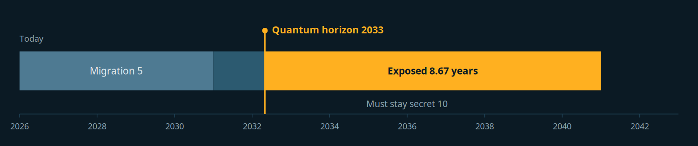

# Miftah

**مفتاح**. Cryptographic inventory and post quantum readiness.

Miftah reads a code tree, a set of certificates and a list of live endpoints, then tells you three things: what cryptography you are actually running, how much of it a quantum computer breaks, and what to do about it in what order.

It writes the inventory as a CBOM in **CycloneDX 1.6**, so it drops into the SBOM tooling you already have rather than becoming another silo.

Zero dependencies. Node built-ins only. Nothing leaves your machine.

```
npx github:SiteQ8/miftah scan .
```

---

## The argument

Most cryptography advice about quantum computers is a date argument, and dates are easy to dismiss. Mosca's inequality turns it into an arithmetic one:

> If **x** (how long your data must stay secret) plus **y** (how long your migration takes) is greater than **z** (how long until a cryptographically relevant quantum computer exists), you are already late.

You do not get to start migrating when the machine is announced. You had to have finished by then, and the data you encrypted years earlier is already sitting in somebody's archive waiting for it. That is the whole harvest now, decrypt later problem, and it is why an inventory is worth building today rather than in 2031.

Miftah makes that inequality the centre of the report:



Ten years of required secrecy plus five years of migration against a 2033 horizon leaves you exposed for **8.67 years**. The amber span is not a risk in the abstract, it is the stretch of calendar during which traffic captured today can be read. Move any of the three numbers and the picture moves with it. The console lets you drag them.

---

## What it finds

**In code and configuration.** Rules covering MD5, SHA-1, 3DES, DES, RC4, ECB mode, RSA and DH below 2048, static initialisation vectors, hard coded keys, weak randomness used in a cryptographic context, PBKDF2 iteration counts below guidance, deprecated TLS versions, and certificate verification switched off. Post quantum algorithms are detected too, so the inventory records what is already right.

Each language is read in its own idioms, not in the JavaScript spelling of the same algorithm:

| | |
| --- | --- |
| Java | `Cipher.getInstance("DESede/CBC/PKCS5Padding")`, `MessageDigest.getInstance("MD5")`, `KeyPairGenerator` sized on the next line |
| C# | `SHA1Managed`, `TripleDESCryptoServiceProvider`, `CipherMode.ECB`, a validation callback that returns true |
| Go | `crypto/des`, `des.NewCipher`, `InsecureSkipVerify`, `tls.VersionTLS10`, `math/rand` |
| PHP | `mcrypt_encrypt`, `MCRYPT_3DES`, `MCRYPT_MODE_ECB`, `mt_rand` |
| Ruby | `OpenSSL::Digest::MD5`, `OpenSSL::Cipher.new('DES-EDE3-CBC')` |
| Swift | `CC_MD5`, `kCCAlgorithm3DES`, `kCCOptionECBMode` |

All four spellings of 3DES above resolve to one asset in the inventory. A scanner that reads nothing is worse than no scanner, because a clean report retires the question.

**In your dependencies.** Cryptography is often not written in your code at all. Manifests are parsed structurally across eight ecosystems, so `package.json`, `requirements.txt`, `pyproject.toml`, `go.mod`, `pom.xml`, `build.gradle`, `Gemfile`, `Cargo.toml`, `composer.json` and `*.csproj` all contribute to the inventory. Each recognised library says what it provides and what that implies once a quantum computer exists.

Deliberately not a vulnerability scanner. There is no CVE feed and nothing is fetched, because a tool you point at your private keys should not phone anywhere. What it does is name the libraries that provide cryptography, flag the few that are abandoned or have unsafe defaults, and record post quantum libraries as the good news they are.

Dependencies appear in the CBOM as CycloneDX `library` components with a package URL, which is what turns a cryptographic inventory into an actual bill of materials.

**In certificates.** Signature algorithm read from the DER, public key type and size, curve, and expiry. Graded on all three.

**On the wire.** TLS probed once per protocol version from 1.0 to 1.3, capturing the negotiated suite, the key exchange group, and the full chain. SSH probed at the transport layer, reading the server KEXINIT to judge key exchange, host key, cipher and MAC algorithms, and to report whether any post quantum key exchange is offered at all.

Every finding carries two verdicts, not one: a **classical** judgement and a **quantum** judgement. SHA-256 is classically sound and quantum weakened. RSA-4096 is classically strong and quantum broken. Collapsing those into a single score is how inventories end up misleading.

### Naming an algorithm is not using one

Run this against a security codebase and the difference matters immediately. A denylist of weak ciphers, a test asserting the weak ones get caught, and a fixture called `vulnerable_config.env` are not vulnerabilities, they are the tool working. Scanning fifteen security repositories produced 1582 findings and 14 criticals before this was handled, almost all of it noise that buried the four findings that were real.

Findings in tests, in files that name themselves insecure, in prose, and on lines that read as a list of algorithm names are tagged and **downgraded, never dropped**, because a real key committed to a test fixture is still a real key. Dependency lockfiles are skipped, since one `package-lock.json` contributed 1474 `sha512` integrity hashes on its own.

The inverse mistake is the more dangerous one, so it is guarded explicitly: an OpenSSL cipher string in a configuration file names many suites at once and is the most actionable line in the file. Configuration is never treated as a catalogue, and `examples/` keeps full severity because people copy from examples into production more readily than from tests.

Comments are read as discussion too, since a security codebase comments about cryptography by definition. So are regexes that detect algorithms, lists of protocol versions, sentences inside strings, and probes that deliberately offer weak ciphers to see whether the far end accepts them. A source file naming ten or more distinct algorithms is a table of them rather than an application, because no application reaches for ten primitives in one file.

For everything else there is `.miftahignore`, which is gitignore shaped:

```
examples/
docs/sample-*
**/testdata/
```

`--strict` turns all the downgrading off. `--no-ignore-file` ignores the ignore file.

---

## Usage

```bash
# Scan a tree, write the CBOM and a report
miftah scan . --cbom cbom.json --html report.html

# Fail a build on anything high or worse
miftah scan . --fail-on high

# Inspect certificates
miftah cert /etc/ssl/certs/service.pem

# Probe live endpoints
miftah tls example.com:443
miftah ssh example.com:22

# Or probe both as part of a scan, so one report covers the whole estate
miftah scan . --endpoint example.com:443 --ssh example.com:22

# Arabic report
miftah report scan.json --lang ar --html تقرير.html

# Interactive console from a scan result
miftah console scan.json --out console.html
```

### Put the assumptions where they can be argued with

The three numbers decide every score here, and until they were committed they lived only in whoever wrote the pipeline. Assumptions nobody can see are assumptions nobody can argue with, and the whole point of drawing the horizon as a line rather than a fact is that it should be argued with.

`.miftahrc.json`, read from the scanned root:

```json
{
  "profile": {
    "shelfLife": 25,
    "migrationYears": 7,
    "crqcYear": 2035,
    "exposure": "internal"
  },
  "failOn": "high",
  "vendors": "suppliers.txt"
}
```

A flag typed today beats a file written last year, and every run says where each value came from:

```
10 years of secrecy, 5 years to migrate, horizon 2033, internet exposure using defaults throughout.
```

A file that will not parse is refused rather than ignored, because falling back to defaults silently would score the estate against assumptions nobody chose. `--no-config` skips it deliberately.

Adjust the assumptions when the defaults do not fit your data:

```bash
miftah scan . --shelf-life 25 --migration 7 --horizon 2035 --exposure internal
```

| Flag | Meaning | Default |
| --- | --- | --- |
| `--shelf-life` | Years the data must stay secret | 10 |
| `--migration` | Years your migration will realistically take | 5 |
| `--horizon` | Year a cryptographically relevant quantum computer is assumed | 2033 |
| `--exposure` | `internet`, `partner`, `internal`, `airgapped` | internet |
| `--fail-on` | Exit non zero at this severity or worse | none |

---

## Getting it into CI without it being deleted

A scanner that fails the build on everything it finds is removed from the pipeline within a week, because on any codebase with history it fails from the first run and never stops. So record what is already there first:

```bash
npx github:SiteQ8/miftah baseline .
git add .miftah-baseline.json && git commit -m "Accept current cryptography"
```

From then on the build fails only on what arrives after today:

```bash
miftah scan . --baseline .miftah-baseline.json --fail-on high --sarif miftah.sarif
```

Nothing is hidden. Every accepted finding still appears in the JSON, the CBOM and the report, and the summary always says how many the baseline absorbed and how many have been fixed since. The baseline file lists the rule, file and title beside each hash, so it can be read in a pull request rather than rubber stamped.

Fingerprints deliberately exclude the line number. Code moves constantly, and a baseline that expires on every refactor teaches people to regenerate it without reading the diff.

```bash
miftah baseline . --prune     # drop entries whose findings are fixed
```

Ready to copy: [GitHub Actions](examples/ci/github-actions.yml), [GitLab CI](examples/ci/gitlab-ci.yml), [a pre commit hook](examples/ci/pre-commit.sh). There is a walkthrough with the same steps at [siteq8.github.io/miftah/start.html](https://siteq8.github.io/miftah/start.html), including what to do when the output looks wrong.

### Watching the estate move

A baseline answers whether this build is worse than the last one. A diff answers the question a steering committee asks, which is how the estate moved over a quarter.

```bash
miftah diff last-quarter.json now.json
```

It reports what was fixed, what arrived, which assets got worse, and one number that has no code change behind it at all:

```
  Margin lost to time  0.5 years. Runway 6.83 to 6.33 years.
  The horizon is a fixed year, so standing still moves you toward it.
```

An estate that was left completely alone is measurably worse than it was, and a report that lists only changed files will never say so. `--fail-on` with `diff` exits non zero on a regression.

### SARIF

`--sarif miftah.sarif` writes SARIF 2.1.0, validated against the published schema, so findings land in GitHub code scanning, GitLab or Azure DevOps rather than in a terminal nobody reads twice. Severity is carried as `security-severity` because that is what GitHub renders, and every result carries a stable fingerprint so one alert survives a refactor instead of closing and reopening.

With a baseline in place, code scanning shows only what is new.

---

## The CBOM

The inventory is written as CycloneDX 1.6 with every asset typed `cryptographic-asset`, carrying the registered OID, the CycloneDX primitive, the NIST post quantum security level where one applies, and `evidence.occurrences` linking each asset back to the file and line it was found on.

It validates against the published schema:

```bash
miftah scan . --cbom cbom.json
curl -sO https://raw.githubusercontent.com/CycloneDX/specification/master/schema/bom-1.6.schema.json
# then validate with any JSON Schema Draft 7 validator
```

---

## The console

`miftah console` builds a single self contained HTML file. Drop a scan result on it and you get the inventory, the technical debt view and the roadmap, with the three Mosca assumptions as live controls. No server, no build step, no network access. The scoring model in the page is tested against the Node implementation for exact agreement.


The number is the interface. It is the first thing on the page and it moves the moment you touch a slider.

---

## The roadmap

Findings are sorted into five waves, because doing this in the wrong order wastes the budget:

| Wave | | When |
| --- | --- | --- |
| 0 | Stop the bleeding | now |
| 1 | Know and govern | 0 to 6 months |
| 2 | Protect traffic in flight | 3 to 12 months |
| 3 | Protect data at rest | 9 to 24 months |
| 4 | Re root identity and signing | 18 to 36 months |

Wave 0 is deliberately not about quantum computers. MD5 and RC4 do not need one.

---

## Crypto agility

Ten of fourteen checks are answered from the tree: whether a pipeline generates the inventory, whether certificates are sound and short lived, whether ownership is recorded, and whether suppliers have been asked. The score says how many it could answer, because a number computed over ten questions and presented as if it answered fourteen is the tool claiming more than it measures.

`--vendors suppliers.txt` covers the part that cannot be scanned. Most of an estate is bought rather than built, so the supplier's schedule becomes yours:

```
# name | status | target
Acme HSM            | committed | 2027
Regional CA         | asked
Core banking vendor | unknown
```

Fourteen checks on whether the next migration will be cheaper than this one: is the algorithm behind configuration or a literal, is there a rotation path, is the key material addressable, is there an inventory in CI. Scored separately from the risk, because an estate can be sound today and still be impossible to change.

---

## Notes on the model

The horizon default of **2033** is an assumption, not a prediction, and Miftah shows it as a dashed line precisely so you can argue with it. NIST IR 8547 sets 2030 for deprecation of classical public key cryptography and 2035 for disallowing it; those dates are treated as policy anchors rather than physics.

Risk is scored per asset from quantum exposure, classical weakness, how widely the asset is used, and how exposed the environment is. Readiness counts a quantum resistant asset in full and a weakened one at half.

None of this is a substitute for reading the findings. The score is a way to sort them.

---

## Development

```bash
git clone https://github.com/SiteQ8/miftah
cd miftah
node --test "test/*.test.js"
```

177 tests. The probe tests spin up local TLS and SSH servers and generate real certificates with openssl rather than asserting against fixtures. The console tests execute the page in jsdom and compare its scoring to the Node implementation.

---

## Licence

MIT. See [LICENSE](LICENSE).

Built by [Ali](https://github.com/SiteQ8).
